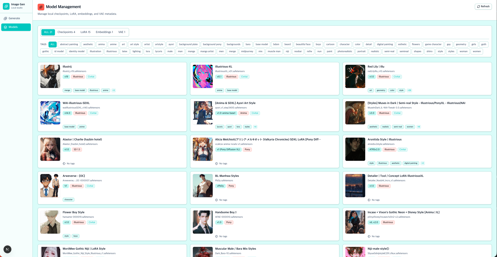

# Image Gen

Local image generation UI built with Next.js and ComfyUI.




## Requirements

- Node.js
- npm
- Python 3
- git

## Setup

Install app dependencies:

```bash
npm install
```

Install ComfyUI into the project root on macOS/Linux:

```bash
npm run setup:comfyui
```

On Windows PowerShell:

```powershell
npm run setup:comfyui:win
```

The setup script clones ComfyUI into `ComfyUI/`, creates `ComfyUI/venv`, installs ComfyUI Python dependencies, and creates the expected model directories.

## Models

Model weights are not committed to git. Put local files in the matching ComfyUI folders:

```text
ComfyUI/models/checkpoints/
ComfyUI/models/loras/
ComfyUI/models/embeddings/
ComfyUI/models/vae/
ComfyUI/models/upscale_models/
ComfyUI/models/controlnet/
```

Files such as `.safetensors` stay local. Model metadata can be committed through `data/model-catalog.json`.

## Run

On macOS, double-click `Launch Image Gen.command` from Finder. It starts ComfyUI and the Next.js app, then opens `http://localhost:3100`.

On Windows, double-click `Launch Image Gen.bat`. It runs the same local launcher through PowerShell.

You can also run the same launcher from a terminal:

```bash
npm run local
```

On Windows PowerShell:

```powershell
npm run local:win
```

Start ComfyUI on macOS/Linux:

```bash
npm run comfyui
```

On Windows PowerShell:

```powershell
npm run comfyui:win
```

Start the Next.js app in another terminal:

```bash
npm run dev -- --port 3100
```

Open `http://localhost:3100`.

By default the app connects to `http://127.0.0.1:8188` and reads models from `ComfyUI/models`. Copy `.env.example` to `.env.local` if you need to override those paths.
