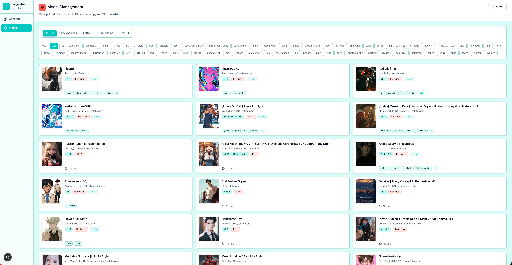

# Image Gen

Local image generation UI built with Next.js and ComfyUI.




## Requirements

- Node.js
- npm
- Python 3
- git

## Setup

Start with [Local image backends](docs/image-backends-setup.md) for the complete
Windows setup order, shared model layout, ports, and backend selection. Related
guides: [ComfyUI](docs/comfyui-setup.md), [A1111](docs/a1111-setup.md),
[Forge](docs/forge-setup.md), and
[Civitai metadata reproduction](docs/civitai-metadata-reproduction.md). For the
current editor, Hires/ADetailer behavior, and gallery controls, see
[Image generation UI](docs/image-generation-ui.md).

### Backends

| Backend | Default URL | Recommended use | Setup script |
| --- | --- | --- | --- |
| ComfyUI | `http://127.0.0.1:8188` | Krea 2, Wan/LTX, video, ComfyUI workflows | `setup:comfyui` (macOS/Linux + Windows) |
| AUTOMATIC1111 v1.10.0 | `http://127.0.0.1:7860` | Civitai images made with A1111 | `setup:a1111` / `setup:a1111:win` |
| ForgeUI | `http://127.0.0.1:7861` | Illustrious/SDXL needing Forge compatibility | `setup:forge` / `setup:forge:win` |

The A1111 and Forge setup scripts install and validate ADetailer automatically
on every supported platform. The local launcher repairs a missing extension
before starting the WebUI. On Apple Silicon (MPS), fp8/fp4 models cannot run — use
bf16 variants instead. All three servers can run at once; before generation the
app unloads the inactive backends' checkpoints.

Install app dependencies:

```bash
npm install
```

Configure the local git merge driver once after cloning:

```bash
npm run setup:git-merge
```

On Windows PowerShell:

```powershell
npm run setup:git-merge:win
```

Install ComfyUI into the project root on macOS/Linux:

```bash
npm run setup:comfyui
```

On Windows PowerShell:

```powershell
npm run setup:comfyui:win
```

The setup script clones ComfyUI into `ComfyUI/`, creates `ComfyUI/venv`, installs ComfyUI Python dependencies, and creates the expected model directories. It pins ComfyUI to the commit in `comfyui-config/comfyui-version.txt` for reproducibility, and then provisions the version-controlled ComfyUI config (see below).

## ComfyUI config (custom nodes, workflows, settings)

Unlike model weights, small ComfyUI assets are version-controlled under `comfyui-config/` so a fresh clone can reproduce the same setup:

```text
comfyui-config/custom-nodes.json      # custom node repos pinned to commits
comfyui-config/comfyui-version.txt    # pinned ComfyUI commit
comfyui-config/workflows/             # GUI workflow JSONs
comfyui-config/settings/              # baseline comfy.settings.json
```

`npm run setup:comfyui` provisions these automatically. To (re)provision on its own:

```bash
npm run setup:comfyui-config          # macOS/Linux
npm run setup:comfyui-config:win      # Windows
```

The provisioning is idempotent: it installs/pins custom nodes into `ComfyUI/custom_nodes/`, copies workflows into `ComfyUI/user/default/workflows/`, and seeds settings only if missing. Pass `--force` (or `-Force` on Windows) to overwrite existing workflows/settings. To add a node or bump a version, edit `comfyui-config/custom-nodes.json` and rerun. Restart ComfyUI afterward to load new nodes.

## Models

Model weights are not committed to git. Put local files in the matching ComfyUI folders:

```text
ComfyUI/models/checkpoints/
ComfyUI/models/loras/
ComfyUI/models/embeddings/
ComfyUI/models/vae/
ComfyUI/models/upscale_models/
ComfyUI/models/controlnet/
```

Files such as `.safetensors` stay local. Model metadata can be committed through `data/model-catalog.json`.

`data/model-catalog.json` is shared, but every user may have different local
models. The repo includes a custom git merge driver for that file. During
`git pull`, it keeps your local catalog values for matching model paths and
adds new catalog entries from the pulled branch when they do not exist locally.
Run `npm run setup:git-merge` once per clone so git can use that merge driver.

## Civitai API token

The app downloads models directly from Civitai (the download actions in the model
manager and the missing-resource prompts) and reads license/metadata through the
Civitai API. Both need a personal API token.

1. Sign in at [civitai.red](https://civitai.red) (or civitai.com — same account)
   and open **Account settings** (`https://civitai.red/user/account`).
2. Scroll to **API Keys**, click **Add API key**, give it a name, and copy the
   generated token.
3. Add it to `.env.local` in the project root:

   ```dotenv
   CIVITAI_API_TOKEN=your-token
   ```

4. Restart `npm run dev` so the server reads the new value.

Without a token, downloads fail with `CIVITAI_API_TOKEN is not configured`. Never
commit `.env.local` or the token to git.

## Run

On macOS, double-click `Launch Image Gen.command` from Finder. It starts ComfyUI and the Next.js app, then opens `http://localhost:5353`.

On Windows, double-click `Launch Image Gen.bat`. The launcher installs missing
Node dependencies, ComfyUI, A1111, and the LoRA runner; starts ComfyUI, A1111,
and the app; then opens `http://localhost:5353`. First launch can take a while.
Existing listeners on ports 5353, 8188, and 7860 are stopped before startup.
Keep the launcher window open; closing it stops the processes it started. Logs
are under `.local/logs/`.

You can also run the same launcher from a terminal:

```bash
npm run local
```

On Windows PowerShell:

```powershell
npm run local:win
```

Start ComfyUI on macOS/Linux:

```bash
npm run comfyui
```

On Windows PowerShell:

```powershell
npm run comfyui:win
```

Start the Next.js app in another terminal:

```bash
npm run dev -- --port 5353
```

Open `http://localhost:5353`.

By default the app connects to `http://127.0.0.1:8188` and reads models from `ComfyUI/models`. Copy `.env.example` to `.env.local` if you need to override those paths.

## Image generation UI

The editor is organized into Import, Models, Composition, Output, Advanced,
Upscaler, and ADetailer sections. Width and height always describe the requested
**final image size**. When Hires is enabled, the app derives the first-pass size
from the final size and upscale factor, then targets the requested dimensions.

ADetailer supports a detector, optional detail checkpoint and LoRAs, separate
positive/negative prompts, steps, confidence, mask blur, denoise, and noise
settings. Generated-image metadata preserves those settings. See
[Image generation UI](docs/image-generation-ui.md) for backend requirements and
gallery/viewer actions.

## Video generation

The `/video` page queues a ComfyUI API workflow. The selected UI preset chooses
an allowlisted workflow; `COMFYUI_VIDEO_WORKFLOW_PATH` is only the default/fallback.

| UI preset | Workflow | Input |
| --- | --- | --- |
| Wan 2.2 SmoothMix | `workflows/wan22-i2v-smoothmix-api.json` | image required |
| Wan 2.2 Base | `workflows/wan22-i2v-base-api.json` | image required |
| LTX 2.3 10Eros | `workflows/ltx23-10eros-t2v-api.json` | text prompt |

Each workflow refers to its model weights by exact filename, so place them under
`ComfyUI/models/` using the names in
[Local image backends](docs/image-backends-setup.md#video-generation-wan-22-and-ltx-23),
which lists every Wan/LTX file, folder, and SHA-256. Restart ComfyUI after adding
weights.

> Most Wan/LTX weights (and the LTX Gemma encoder) are fp8/fp4, which **cannot run
> on Apple Silicon (MPS)**. Video generation needs an NVIDIA/CUDA host (local or
> RunPod). See [RunPod deployment](docs/RUNPOD-image-gen-deploy.md).

To author your own workflow, export an API-format JSON from ComfyUI and use
placeholders such as `{{prompt}}`, `{{negative_prompt}}`, `{{width}}`,
`{{height}}`, `{{num_frames}}`, `{{fps}}`, `{{steps}}`, `{{cfg}}`, `{{seed}}`, and
`{{source_image}}` in the node inputs that the UI should fill.
